<h1 align="center"> Selenium Code - Java - CrossBrowser Testing - single test of sample application in 3 different browsers in docker running in AWS CodePipeline  </h1>  

  Description: This is a demo testcase on java tech with TestNg framework.
There is a single test which opens the website: https://anupdamoda.github.io/AceOnlineShoePortal/index.html# and verifies the Title of the website and 
the same test is being performed in 3 different browsers: Google Chrome, Microsoft Edge, Mozilla Firefox
and this is being run in AWS Code pipeline 

## Table of Contents

- [Introduction](#introduction)
- [Features](#features)
- [Requirements](#requirements)
- [Quick Start](#quick-start)

## Introduction
This is a demo testcase on java tech with TestNg and selenium test.
https://anupdamoda.github.io/AceOnlineShoePortal/index.html#

## Features
Selenium Tests

## Test Requirements

### Local
* [Java 11 SDK](https://www.oracle.com/au/java/technologies/javase/jdk11-archive-downloads.html)
* [Maven](https://maven.apache.org/download.cgi)
* [ChromeDriver](https://chromedriver.chromium.org/downloads)

## Execution modes ## 🤖 Starting up

command: come to the project file and perform "Docker Compose Up"
once the docker hub and nodes are up and running then perform the tests by right-clicking on the TestNG and running the tests.

This test is designed to run locally or in AWS Codepipeline:
push the code into Github first.

In order to configure the AWS code pipeline please follow these steps:

Click on 'Create pipeline'
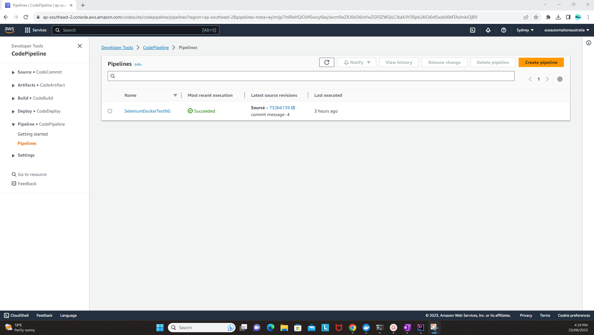

Enter the details of the new pipeline
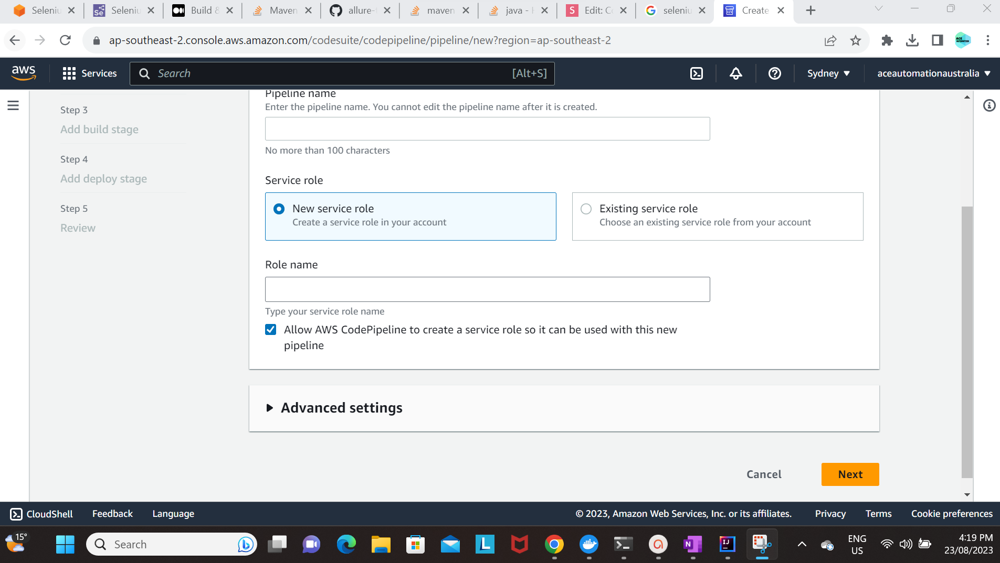

Select the Source
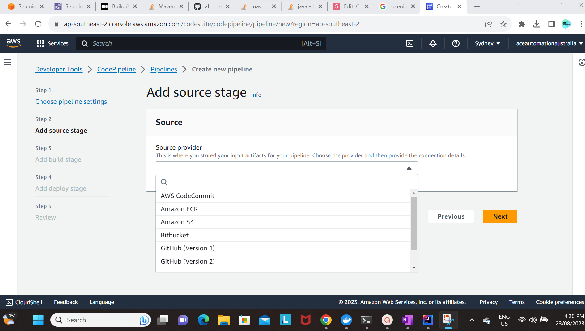

Click on 'Connect to GitHub'
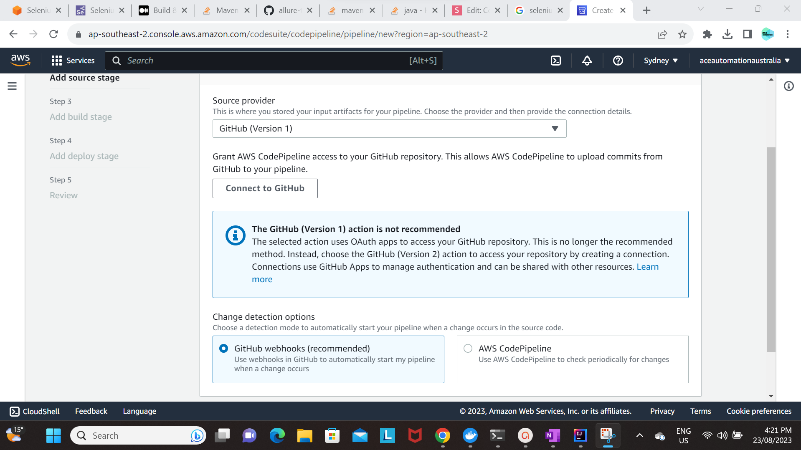

Select the Repository & Branch
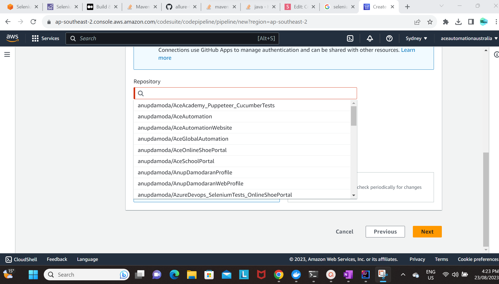

in the Build Stage select the "AWSCodebuild"
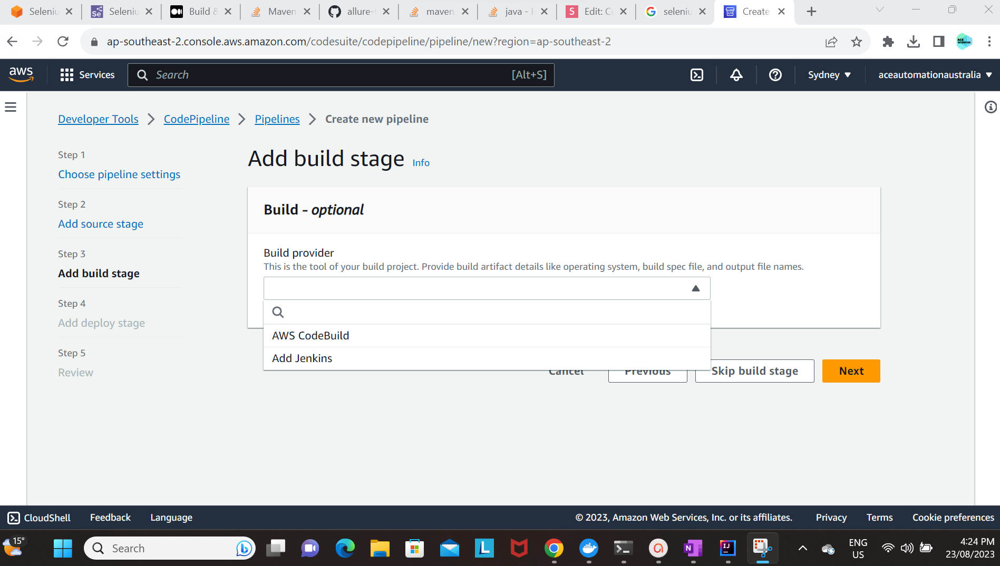

and details about the Region and Create Project
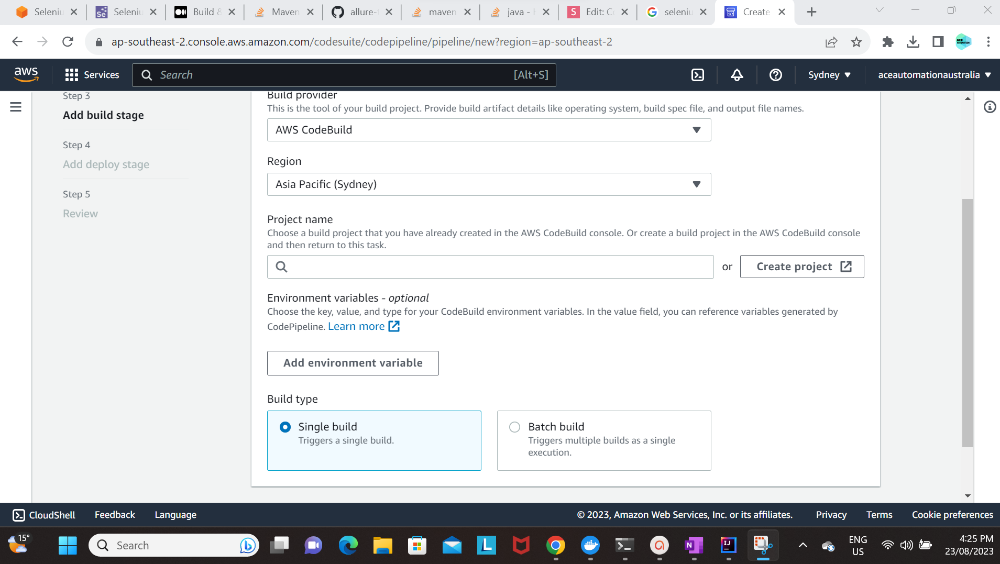

Enter the details of the Project and some description
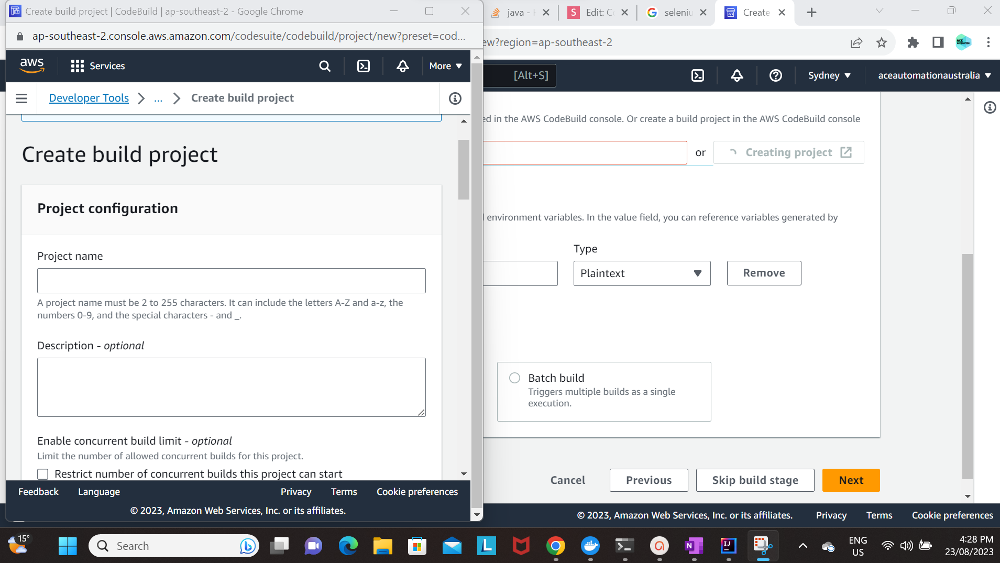

and the details of the operating system as "Ubuntu" and the environment image as "Managed image"
and select the checkbox if you want docker engine to run
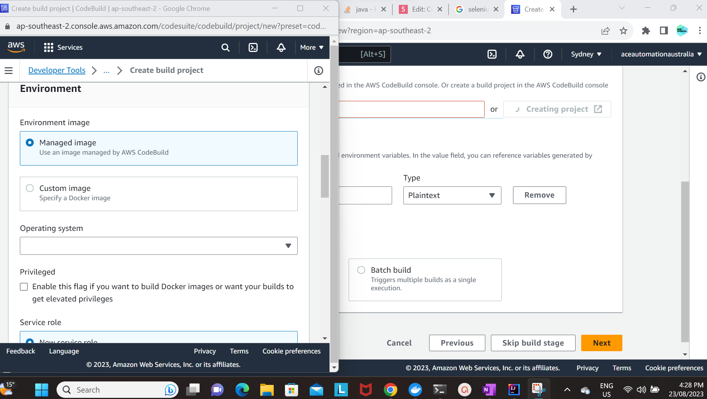

and select the build spec - which should be present in the project
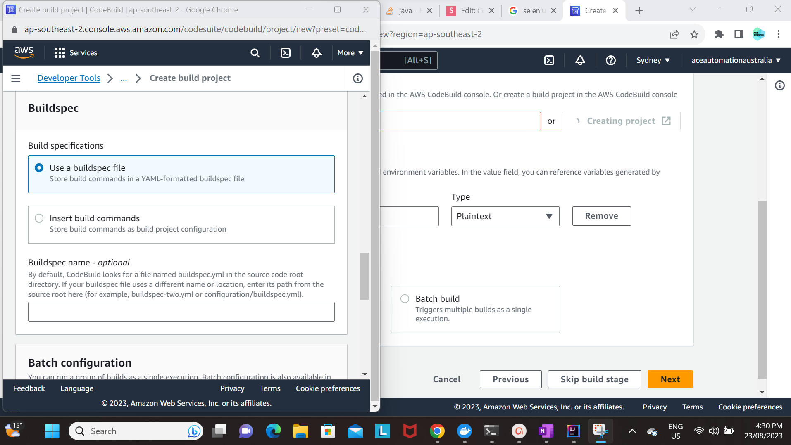

***
Post setting up & running the AWS Codepipeline:

the success run would look like the below:
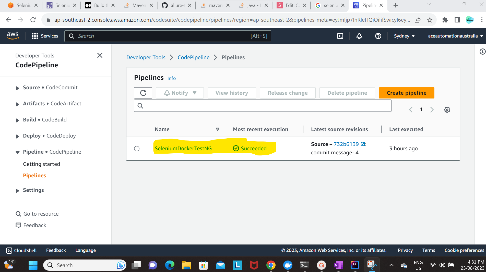

and the results would appear like the below:
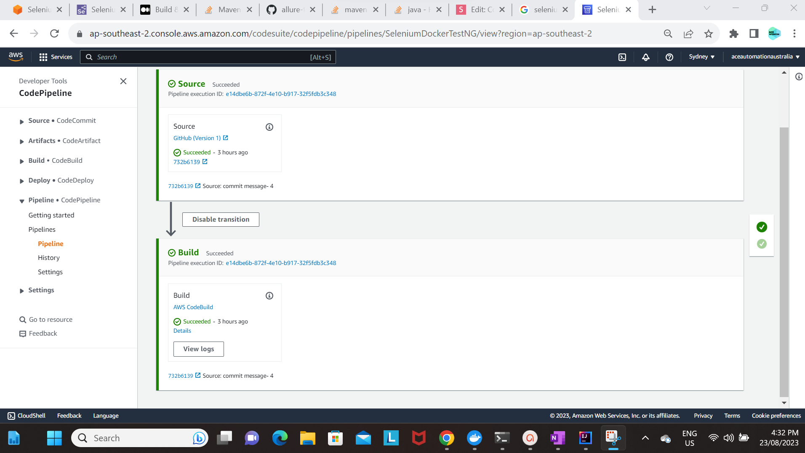